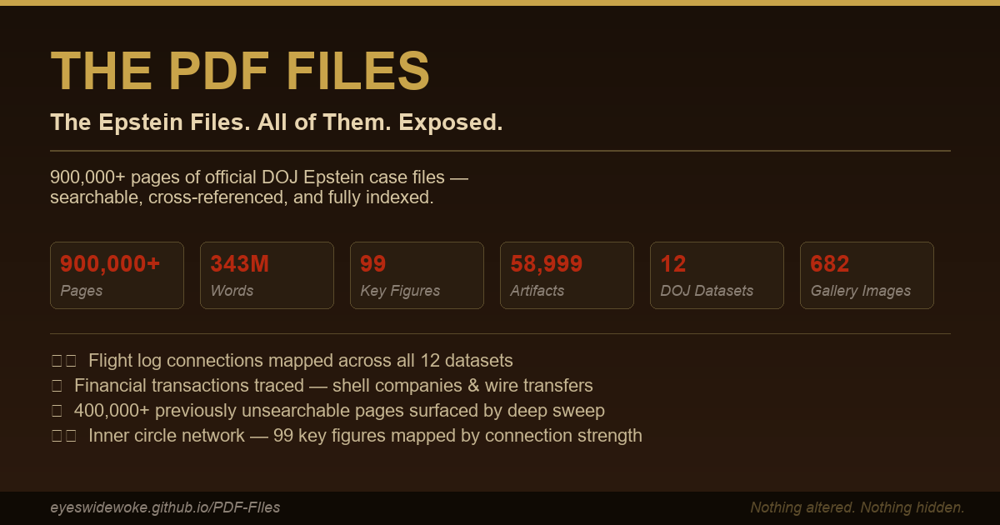

# THE PDF FILES

### 900,000+ official DOJ documents containing over 3 million pages of Epstein case files — searchable, cross-referenced, and fully indexed. Every name. Every flight. Every dollar. Every deposition.

[](https://eyeswidewoke.github.io/PDF-FIles/)
[](https://eyeswidewoke.github.io/PDF-FIles/)
[](https://eyeswidewoke.github.io/PDF-FIles/)
[](https://eyeswidewoke.github.io/PDF-FIles/)
[](./LICENSE)

---

<!-- TODO: Replace with actual screenshot once og-image.png is created -->
<!--  -->

## The Epstein Files. All of Them. Exposed.

On January 9, 2025, the U.S. Department of Justice unsealed over **900,000 official documents** — containing more than **3 million pages** — from the Jeffrey Epstein investigation. Flight logs, financial records, depositions, FBI reports, victim statements, and communications involving some of the most powerful people on Earth.

Most people will never read them. They were released as raw, unsearchable PDFs — thousands of files buried across 12 separate datasets. That's by design.

**THE PDF FILES** is an independent, open-source project that has extracted, indexed, and cross-referenced every document in the official DOJ release. **343 million words** have been parsed. **99 key figures** are tracked across every mention. Every page is searchable. Nothing has been altered. Nothing has been hidden.

> *"Sunlight is the best disinfectant."* — U.S. Supreme Court Justice Louis Brandeis

### 🔗 **[Explore the live site →](https://eyeswidewoke.github.io/PDF-FIles/)**

---

## By the numbers

| Metric | Count |
|--------|-------|
| 📄 Official DOJ documents | **900,000+** |
| 📄 Total pages across all documents | **3,000,000+** |
| 📝 Words indexed | **343 million** |
| 📁 Searchable artifacts | **58,999** |
| 📦 DOJ datasets processed | **12** |
| 👤 Key figures tracked | **99** |
| 🖼️ Gallery images classified | **682** |
| ⏱️ Timeline events mapped | **51** |
| 📋 Cast profiles built | **98** |

---

## What we found

- ✈️ **Flight log connections mapped** — every Lolita Express passenger cross-referenced across all 12 datasets with date, route, and co-passenger data
- 💰 **Financial transactions traced** — wire transfers, trust structures, shell companies, and payment flows indexed from DOJ financial exhibits
- 📑 **400,000+ previously unsearchable pages surfaced** — deep sweep OCR recovered text from blank-flagged and image-only PDFs that standard extraction missed
- 🕸️ **Inner circle network reconstructed** — 99 key figures mapped by role, document frequency, and connection strength across the full corpus

---

## What this project is

- A fully searchable, static website indexing every document in the official DOJ Epstein release
- A cross-referenced research tool: search by name, by topic, by dataset, or across the entire corpus
- Built with structured content (`content/`, `data/`), 40+ Python extraction scripts, and CLIP-based image classification
- Fork-friendly — clone it, mirror it, host it yourself. Public domain.

## What this project is NOT

- ❌ Not a prosecutorial finding or legal adjudication
- ❌ Not a claim that any mention in source text implies guilt or wrongdoing
- ❌ Not a complete binary mirror of every source artifact
- ❌ Not affiliated with the DOJ, any government agency, or any media outlet

---

## Repository layout

```
index.html              Main entry point
search.html             Cross-site search UI
release-guide.html      Release/package orientation
cast.html               98 key-figure profile pages
content/                Source-linked markdown artifacts
data/public-data.json   Dataset and mirror link definitions
findings/               Investigation markdown reports
.github/workflows/      Sanitized Pages deploy workflow
```

## Supporting documentation

| Document | Purpose |
|----------|---------|
| [`METHODS.md`](./METHODS.md) | Counting rules, OCR pipeline, deduplication, assumptions |
| [`DATA_SOURCES.md`](./DATA_SOURCES.md) | Source package map and integrity workflow |
| [`CITATION.md`](./CITATION.md) | How to cite findings and document IDs |
| [`LEGAL.md`](./LEGAL.md) | Legal scope and interpretation boundaries |
| [`ETHICS.md`](./ETHICS.md) | Privacy and handling standards |
| [`MIRROR.md`](./MIRROR.md) | Quick mirror/fork instructions |
| [`CONTRIBUTING.md`](./CONTRIBUTING.md) | Contribution workflow and issue templates |
| [`SECURITY.md`](./SECURITY.md) | Vulnerability reporting process |
| [`CHANGELOG.md`](./CHANGELOG.md) | Version history and release notes |

---

## Quick start

### View the live site

**[https://eyeswidewoke.github.io/PDF-FIles/](https://eyeswidewoke.github.io/PDF-FIles/)**

### Run locally

```powershell
git clone https://github.com/Eyeswidewoke/PDF-FIles.git
cd PDF-FIles
python -m http.server 8000
# Open http://localhost:8000
```

### Fork & deploy your own mirror

1. Fork this repository
2. In your fork, go to `Settings → Pages → Source` and select `GitHub Actions`
3. Push to `main` — the included workflow (`.github/workflows/pages.yml`) handles the rest

### Download the full archive

[Download ZIP snapshot (main branch)](https://github.com/Eyeswidewoke/PDF-FIles/archive/refs/heads/main.zip)

---

## Contributing

See [`CONTRIBUTING.md`](./CONTRIBUTING.md) for the full workflow. Issue templates are included for:
- Broken links / missing artifacts
- Doc-ID mapping corrections
- OCR / text extraction errors

## Security

Do not post exploit details in public issues. See [`SECURITY.md`](./SECURITY.md).

---

## License

Released into the **public domain** under [The Unlicense](./LICENSE).

Fork it. Mirror it. Share it. The documents belong to the public.
